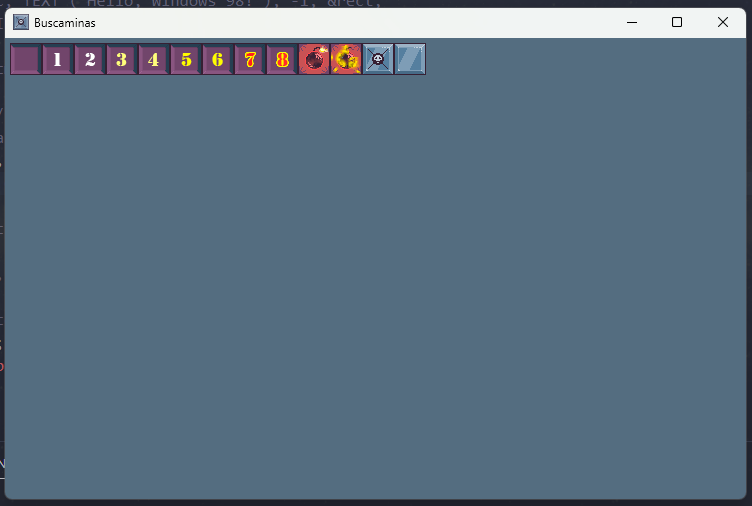

<!-- ++++++++++++++++++++++++++++++++++++++++++++++++++++++++

    ABRE ESTE ARCHIVO EN MODO DE VISTA PREVIA

+++++++++++++++++++++++++++++++++++++++++++++++++++++++++ -->

# Proyecto Buscaminas

Autor: **Luis Isaac Tavera Zarate** \
Fecha: **07/05/2024**

**Universidad de Guanajuato**

Clase: **Programación Orientada a Objetos y Eventos** \
Profesor: **Ignacio Raul Rosas Roman**

## Introducción

Buscaminas es un juego de lógica creado en 1989. El objetivo es deducir los sectores del terreno
que contienen minas para identificarlos mediante una bandera. El juego termina cuando todos
los sectores con minas han sido marcados correctamente.

El terreno se compone de sectores en los que no se sabe a priori si están minados o son seguros.
El usuario debe determinar el estado del sector, uno a la vez. Cuando se descubre un sector
minado el juego termina, pero si es seguro, se muestran la cantidad de minas que hay en la
vecindad del sector.

(Actividad completa del proyecto en `0101_Actividad.pdf` subido a la plataforma del SUME )

## Acerca de este repositorio - IMPORTANTE

El objetivo de este repositorio es que comprendamos mejor los programas que realizamos en el curso de POOE, evitar solo copiar el código y no saber que es lo que estamos haciendo.

Otra motivación para realizar este repositorio es que muchos de nosotros nos perdimos durante la clase o simplemente los programas no funcionaban, así que tener un respaldo como base para comenzar nuestro proyecto me pareció adecuado.

En este repositorio se encuentra en la carpeta `/src` los archivos **necesarios y funcionales** que pueden **descargar** para realizar el proyecto. **No esta actualizado con los cambios mostrados en el siguiente Blog**, estos cambios los tendrá que realizar cada uno de nosotros, pero siempre podrás guiarte con la información presente aquí mientras la voy actualizando, así que mucha suerte a todos. **:)**


Para poder apoyarnos unos a otros, les recuerdo que tenemos un server de Discord privado para el estudio, que les debí de haber compartido junto con este repositorio, si no es así pueden solicitarme el link en mi correo l.isaac.taveraz@gmail.com para que puedan unirse.

## DevBlog

Autor: **Luis Isaac Tavera Zarate**

---

### 1.- Crear, Incluir y Dibujar una textura para el juego

#### Martes 7 de Mayo del 2024

En esta primera parte resolveremos la tarea: `Consigna 1. Bitmaps y recursos` que nos pide lo siguiente:

```txt
-Crear una ventana que presente el mapa de bits de estados
en el área cliente de la ventana de la aplicación.

-Cargue el mapa de bits durante el mensaje WM_CREATE.

-Destruya el mapa de bits de estados durante el proceso del
mensaje WM_DESTROY.

-Durante los mensajes WM_PAINT, use la función BitBlt para
dibujar el mapa de bits.

-Entregue todos los archivos necesarios para construir el
programa. Se deben subir con el nombre E01_PaternoMaterno.zip.
```

Resolvamos...

- Usaremos texturas de **32 x 32 pixeles** para las casillas, todas ellas juntas en un **Mapa de Texturas** de **164 x 32 pixeles** que podemos dibujar en **paint**, para luego exportarla en formato Bitmap (.bmp).

En la imagen `0101_Sector.bmp` contaremos con 13 casillas: (numeración de celda descubierta de 0 a 8, bomba, bomba descubierta _(fin del juego)_, bandera y celda sin descubrir)


_PD. no usen mis texturas xD_

- Una vez hecha la imagen la cargamos dentro del archivo de recursos `0101_Recursos.rc`, de esta forma: (\<identificador> BITMAP \<dirección relativa a este archivo de la imagen>)

```rc
IDI_BITMAP  BITMAP  "0101_Sector.bmp"
```

- Luego incluimos la definición en `0101_Recursos.h` y le damos un identificador, este puede ser cualquier numero entero entre 0 y 16,000. En mi caso escogí el 104.

```h
#define IDI_BITMAP 104
```

Mientras que ya habíamos dibujado bitmaps de tipo **DIBitmap** (Device Independent Bitmap / Bitmaps independientes del dispositivo),
esta vez dibujaremos **bitmaps dependientes del dispositivo**.

- Agregaremos una variable **HBITMAP** llamada **BmpSector** en la clase **CWindow** del archivo ``0101_CWindow.h``:

```cpp
#include <windows.h>

class CWindow{
    private:
        HWND hWnd;
        HBITMAP BmpSector; // <-
    ...
}
```

- Agregaremos las siguientes funciones a **CWindow**:

```cpp
#include <windows.h>

class CWindow{
    private:
    ...
        static LRESULT CALLBACK WndProc(
            HWND hwnd,
            UINT message,
            WPARAM wParam,
            LPARAM lParam); // Este ya esta escrito

        // Nuevo codigo...
        LRESULT OnPaint();
        LRESULT OnCreate( LPCREATESTRUCT create );
        LRESULT OnDestroy();
    ...
};
```

- En ``0101_CWindow.cpp`` dentro de la función **WndProc**, llamaremos a **OnPaint()** cada vez que se dibuja la ventana desde **WM_PAINT**, a **OnCreate()** en **WM_CREATE** y a **OnDestroy()** en **WM_DESTROY**:

```cpp
/* Procedimientos de la ventana CALLBACK */
LRESULT CALLBACK CWindow::WndProc(
    HWND hwnd,
    UINT message,
    WPARAM wParam,
    LPARAM lParam )
{
    switch (message)
    {
        case WM_CREATE:
            return Ventana->OnCreate((LPCREATESTRUCT)lParam);

        case WM_PAINT:
            return Ventana->OnPaint();

        case WM_DESTROY:
            return Ventana->OnDestroy();

    }

    /*  DefWindowProc se encarga de recibir y procesar
        los mensajes que no tengamos definidos en el "switch" y que son
        comunes en ventanas de windows */
    return DefWindowProc(hwnd, message, wParam, lParam);
}
```

- Primero definiremos la función **OnCreate()** tambien dentro de ``0101_CWindows.cpp``, aquí cargaremos la imagen, incluiremos el siguiente código:

```cpp
/* Evento llamado al crear la ventana "WM_CREATE" */
LRESULT CWindow::OnCreate(LPCREATESTRUCT create)
{
    // Asignamos la instancia del programa
    HINSTANCE instance = create->hInstance;
    // Cargamos el bitmap desde la instancia del programa
    // y del recurso incluido en `0101_Recursos.rc`
    BmpSector = LoadBitmap(create->hInstance, MAKEINTRESOURCE(IDI_BITMAP));

    return -(BmpSector == NULL);
}
```

Si falla **LoadBitmap()** la variable **BmpSector** retornara **NULL**, en este caso la función regresara **-1** (ERROR) y si todo sale bien regresara **0** (OK);

- Luego definiremos **OnDestroy()**:

```cpp
/* Evento llamado al destruir la ventana "WM_DESTROY" */
LRESULT CWindow::OnDestroy()
{
    // Liberar el recurso del bitmap
    DeleteObject(BmpSector);
    // Mandar mensaje de fin del programa
    PostQuitMessage(0);

    return 0;
}
```

- Y por ultimo definiremos **OnPaint()**, en esta función indicaremos donde y como dibujar las imágenes que necesitamos para el juego: (Bitmap dependiente del dispositivo)

```cpp
/* Esta función se llama cade vez que windows redibuja la ventana */
LRESULT CWindow::OnPaint()
{
    // Crear un contexto de dibujo
    PAINTSTRUCT ps;
    HDC hdc = BeginPaint(hWnd, &ps);
    // Crea una  y asigna la imagen
    HDC hdcMem = CreateCompatibleDC(hdc);
    SelectObject(hdcMem, BmpSector);

    // Dibujar el bitmap en la ventana
    BitBlt(
        hdc, 5, 5, // destino, margen superior e inferior
        416, 32, // ancho y alto del bitmap
        hdcMem, 0, 0, SRCCOPY); // origen,...
        //... inicio en X y Y del bitmap, etc.
    // Margen de 5 arriba y a la izquierda.

    // Libera el contexto de dibujo
    DeleteDC(hdcMem);
    EndPaint(hWnd, &ps);
    return 0;
}
```

Un HDC es por sus siglas en ingles *"handle device context"* un manipulador de un objeto alojado en el contexto del dispositivo, que es en este caso una imagen y actúa como el origen en la función **BitBlt**.

#### Final de la Sección 1

Con estos cambios ya podremos mostrar la textura en la ventana! **:D**



Si tienes problemas para compilar este programa en la carpeta ``/.vscode`` de este repositorio dejo una copia del archivo ``makefile`` por si no lo tienen actualizado, de cualquier forma puedes pedir ayuda en el grupo de Discord. **:)**

---

### 2.- Dibujar el Campo de Juego
#### Pendiente...

Terminare esta parte el día jueves 9 de mayo y la subiré por la tarde. (Gracias por su paciencia)

<!--

int matriz[x][y] = {...};
matriz[a][b]; // indice = a\*columnas + b
CTerreno contiene CSectores
Hasta el martes se entrega el avanze hasta dibujar una region con un solo sector
desde el constructor (16x16)

Hasta el viernes se entrega el avanze de crear el mapa 30% dificultad
Hacer el algoritmo de descubrir sectores
Para dibujar un solo sector del mapa de bits:
BitBlt (
hDC, c*32, c*32, 32, 32,
hDCMem, estado\*32, 0, SECCOPY
);
-- Numero Aleatorio
// srand de math.h
// Semilla para numeros aleatorios  
 srand( ( unsigned ) std::time( NULL ) );

    // Coloca las minas en el terreno
    UINT celdas = Renglones * Columnas;
    do {
        // Genera un número aleatorio
        UINT indice = rand() % celdas;
        // Direccion de bomba
        // x -> indice % columnas, y -> indice/columnas
        // Buscar a los vecinos y si no es bomba, agregar 1
    }

class CTerreno {
UINT Columnas;
UINT Columnas;
UINT Columnas;
UINT Columnas;
CSector* Sectores;
CTerreno( UINT columnas, ... )
: Columnas( columnas )
public:
static
}
class CSector {
UINT Estado;
UINT Contenido;
enum {
LIBRE, UNO, DOS, TRES, CUATRO...OCHO, MINA, FIN, BANDERA, OCULTO
}
public:
CSector...
GetEstado()
}
// Este acabarlo el miercoles 08/05/2024
void CTerreno::Dibujar( HDC hdcDestino, HDC hdcOrigen )
BitBlt(
hdcDestino, x, y, LADO_CELDA, LADO_CELDA,
hdcOrigen, sector ++ -> GetEstado() * LADO_CELDA, 0,
SRCCOPY
)

\*/

-->
